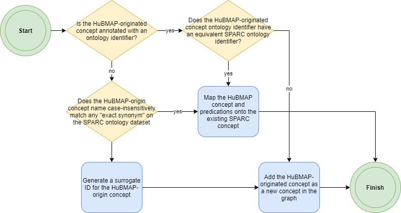

# HuBMAP & SPARC Linkages

> A tool to discover and visualize SPARC and HuBMAP ontology and data linkages

[](https://sparc-fair-codeathon.github.io/hubmap-link/)
[](https://github.com/SPARC-FAIR-Codeathon/hubmap-link/actions/workflows/production-build.yml)
[](https://github.com/SPARC-FAIR-Codeathon/hubmap-link/commits/main)
[](LICENSE)

[](https://sparc-fair-codeathon.github.io/hubmap-link/)

## Product demo

The latest build of this product is at <https://sparc-fair-codeathon.github.io/hubmap-link/>.

## 2-minute demo

https://user-images.githubusercontent.com/34098595/130709306-b49f8b8e-2644-45bb-a344-fe7c9ac2d706.mp4

[Presentation (PDF)](docs/20210726_project_presentation.pdf)

## Project Goals

This application enables visualization and reporting on the linkages between HuBMAP and SPARC. It performs the following functions:

1) Visualization of the anatomical structures ontologically tagged by SPARC and highlight their linkage with HuBMAP CCF / ASCT+B ontology terms
2) Illustrate how those common terms map to the 3D HuBMAP VHCCF reference system
3) Map samples from SPARC to HuBMAP
4) Visualize the term overlaps
5) Visualize the samples both from HuBMAP and SPARC in the same 3D reference system (CCF).

This study of the interlinkages between HuBMAP and SPARC ontologies and data could be very valuable in longitudinal studies and to further the goals of both HuBMAP and SPARC in cross-consortium interoperability.

See the [Project Description](docs/DESCRIPTION.md), [Workflow Document](docs/WORKFLOW.pdf), and [Project Presentation](docs/20210726_project_presentation.pdf) for more background information and initial resources for development.

## Tracking Development

Development is tracked on the [Sprint Backlog](https://github.com/SPARC-FAIR-Codeathon/hubmap-link/projects/1). A [CHANGELOG](CHANGELOG.md) details the new developments with each release.

## Continuous Integration / Continuous Deployment (CI/CD)

This application is built automatically using [GitHub Actions](https://github.com/features/actions) ([status](https://github.com/SPARC-FAIR-Codeathon/hubmap-link/actions/workflows/production-build.yml)). Each push to the `main` branch starts a workflow that builds the latest version of the code and deploys the built application to [GitHub Pages](https://pages.github.com/) ([here](https://sparc-fair-codeathon.github.io/hubmap-link/)). In addition, the API server is updated with each push to the `main` branch from a configured [Heroku](https://www.heroku.com/nodejs) instance ([here](https://hubmap-link-api.herokuapp.com)).

## Installation

This application consists of two parts, a webapp and an API server. The webapp is dependent on the API server for data transformation and to obscure the SciCrunch API key.

To get started locally, follow these instructions:

1. If you haven't done it already, [make a fork of this repo](https://github.com/SPARC-FAIR-Codeathon/hubmap-link/fork).
1. Clone to your local computer using `git`.
1. Make sure that you have Node 14.0 installed. See instructions [here](https://nodejs.org/en/download/).
1. Install your IDE of choice. We recommend [Visual Studio Code](https://code.visualstudio.com/).
1. Install the Angular CLI \
    `npm install -g @angular/cli`

### Quick Start

To quickly get a local installation running, this requires running two terminals.

In the first, run:

```bash
cd api
npm ci
npm run build-ts

# Uncomment if on a linux or mac-based OS:  
# export SCICRUNCH_API_KEY='APIKEYXXXX'

# Uncomment if on a Windows-based OS:  
# set SCICRUNCH_API_KEY=APIKEYXXXX

npm start
```

The local API server will be running at <http://localhost:5000>.

In the second, run:

```bash
cd website
npm ci
npm start
```

The local webapp will be running at <http://localhost:4200> and will connect to the local API server.

### Building, Development, and Deployment

See the [api](api/README.md) and [website](website/README.md) directories for detailed
information on how to install, build, develop, and deploy the projects.

## Project structure

* `/website/` - Parent directory of the hubmap-link web application
* `/website/e2e/` - Configuration directory for application end-to-end testing
* `/website/src/` - Project source code and assets
* `/website/src/app/` - Angular application source code 
* `/website/src/app/components/` - The web component hierarchy 
* `/website/src/app/interfaces/` - Typescript interfaces
* `/website/src/app/services/` - Modules to maintain inter-component state, data, and data-wrangling business logic
* `/website/src/assets/` - Static web assets such as images and datafiles
* `/website/src/environments/` - Build environment configuration
* `/api/` - The API server to obscure api key and perform some datatype conversions
* `/api/src/` - API server source code and assets
* `/api/public/` - Publically exposed API server resources
* `/api/public/scaffolds/` - SPARC Scaffolds converted to CCF-compatible formats
* `/scaffold-to-csv/` - Documentation and raw files demonstrating how to convert SPARC Scaffolds to CCF-compatible formats
* `/docs/` - Documentation resources

## Data sources

| Data Type | Source | Method |
| ----------- | ----------- | ----------- |
| HuBMAP ontology concepts | CCF ASCT+B Reporter [ASCT+B API](https://github.com/hubmapconsortium/ccf-asct-reporter#asctb-api) | The API references production versions of the HuBMAP CCF ASCT+B tables where concepts are curated |
| SPARC AS ontology concepts | FDI Lab [SciCrunch/SciGraph API](https://scicrunch.org/) | Organ anatomical structure concept datasets are extracted via neighbor search referencing inbound [PART_OF](http://www.ontobee.org/ontology/RO?iri=http://purl.obolibrary.org/obo/BFO_0000050) predicate up to 10 degrees |
| SPARC CT ontology concepts | FDI Lab [SciCrunch/SciGraph API](https://scicrunch.org/) | Cell Type concepts are extracted via cypher query on UBERON-to-Cell Ontology single-hop linkages across all predicates |
| HuBMAP dataset metadata | HuBMAP [Elastic Search API](https://smart-api.info/ui/7aaf02b838022d564da776b03f357158) | Dataset metadata is ingested directly from the endpoint |
| SPARC dataset metadata | SPARC [Elastic Search API](https://scicrunch.org/) | Dataset metadata is filtered to human-species subset |

## Ontology concept merging

HuBMAP and SPARC concepts are merged principally based on shared ontology IDs. In the case of SPARC, anatomic structures are uniformly annotated with UBERON-sourced IDs. Most HuBMAP concepts are likewise annotated with UBERON-sourced IDs. However, a small proportion of HuBMAP concepts lack an ontology ID assignment and require additional disambiguation. Where HuBMAP concepts lacked an ontological identifier, the concept name is compared to all exact synonyms among participating SPARC nodes. If no matching synonyms exist in SPARC, then the concept is treated as novel and added to the graph.



## SPARC Scaffold to HuBMAP CCF Reference Organ Conversion

For detailed instructions on how to convert a scaffold to be CCF-compatible, check out the [scaffold-to-ccf](scaffold-to-ccf/README.md) directory.

## Links and acknowledgements

**Team Members**:

* Bruce W. Herr II ([@bherr2](https://github.com/bherr2))
* Samuel O'Blenes ([@soblenes32](https://github.com/soblenes32))
