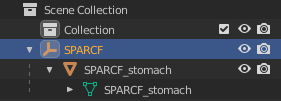

# Converting SPARC Scaffolds to HuBMAP CCF Reference Organs

During the July 2021 SPARC Codeathon, we devised a way to convert a SPARC Scaffold into a HuBMAP CCF Reference Organ. This will facilitate mapping data from SPARC to HuBMAP (and vice versa). Below is a description of the workflow used to convert the SPARC Human Stomach Scaffold. While we did not have time to do more scaffolds, the workflow here should apply to any scaffold which includes a VTK version of the scaffold.

## Pre-requisites

Before starting, you will need to install:

1. [Download](https://www.paraview.org/download/) and install [Paraview Desktop](https://www.paraview.org/desktop/). This application supports exporting a VTK files to GLTF.
1. [Download](https://www.blender.org/download/) and install [Blender](https://www.blender.org/). This application supports modifying and exporting GLTF files to binary GLB format.
1. Install your IDE of choice. We recommend [Visual Studio Code](https://code.visualstudio.com/).
1. Create a `humanStomach` folder to place files in for testing/development.

## Download scaffold VTK

You can find the human stomach scaffold on the [sparc.science website](https://sparc.science/datasets/136?tab=files&path=files%2Fderivative) ([direct download](https://sparc.science/file/136/1?path=files%2Fderivative%2FhumanStomach.vtk)). Download the `humanStomach.vtk` file into your `humanStomach` folder.

## Convert VTK to GLTF

Open the ParaView Desktop app (directions vary by platform), click *File/Open*, and select the downloaded `humanStomach.vtk` file. When loaded, you will initially see a blank scene. Press the eye icon next to `humanStomach.vtk` in the *Pipeline Browser* to see the scaffold.

Next switch the *Coloring* to *Solid Color* in the *Properties* tab. Then click *Edit* below *Solid Color* and use this HTML Color Code: `#EA5162`. Depending on the organ, a different color may be chosen.

Now export the `humanStomach.vtk` to GLTF by clicking *File/Export Scene...*, switching *Files of type:* to *.GLTF Files (\*.gltf)* and save as `humanStomach.gltf`.

You can now close out the Paraview Desktop app.

## Convert GLTF to GLB

Open the Blender desktop app (directions vary by platform). When first opened, there is a default scene with a solid cube. Drag to select the cube, camera, and lighting and press the *delete key* to remove them from the scene.

Next, import the `humanStomach.gltf` file by clicking *File/Import/glTF 2.0 (.glb/.gltf)* and selecting the file from the file chooser. The organ may be very large when first opened, so zoom out to get a view of the organ.

Expand the tree in the *Scene Collection* pane at the top-right. Delete the *Camera Node*, rename `Renderer Node` to `SPARCF`, and rename both `mesh0` items to `SPARCF_stomach`.

Before: \

After: \

Finally, click *File/Export/glTF 2.0 (.glb/.gltf)*, change the `Format` to `glTF Binary (.glb)`, expand `Geometry` and check `Tangents` (in addition to the default selections), and save the scene to `humanStomach_F.glb`.

Keep the scene open for the next step: saving the 'male' version.

### Note on Naming

In the CCF we currently have to have both a Male and Female version of each Reference Organ and they must have unique scene node names. Thus, we use the form `xxxF` for the top level node and `xxxxF_structure` for the organs/structures within. Male forms are formatted analygously with `xxxM`.

### Save the Male scaffold

In the *Scene Collection* pane at the top-right rename all `SPARCF` strings to `SPARCM` for male. Then save the scene to `humanStomach_M.glb` using the same steps as was used for the 'female' version.

### Write down dimensions

You may need to come back to Blender to check dimensions, how far to transform things, etc. But at this stage, take note of the dimensions in preparation for the next stage and close out Blender.

## Create RUI Locations

Go to the [CCF Registration User Interface (RUI)](https://hubmap-ccf-ui.netlify.app/rui/) and create two RUI registrations using the tissue dimensions noted above. Place the 'Tissue' relative to the Skin reference organ for both Male and Female. Use the *REVIEW AND DOWNLOAD* button to save the RUI locations named `humanStomach.VHMSkin.rui_location.json` and `humanStomach.VHFSkin.rui_location.json` respectively.

## Convert RUI Locations to Reference Organs

In order for the scaffolds to be recognized as reference organs, some modifications need to be made to have them be recognized and loaded. You can see the results of the modifications [here](../api/public/scaffolds/humanStomach/humanStomach_F.ccf.jsonld) and [here]([here](../api/public/scaffolds/humanStomach/humanStomach_F.ccf.jsonld)).

## Test in the EUI

Modify the [ccf-eui.html](../website/src/assets/ccf-eui.html) file to include the reference organ files in the dataSources array.

## Ongoing developments

At time of writing, there are still some issues to be worked out and to better streamline the process. Reach out via Slack or a GitHub Issue if you need assistance.
